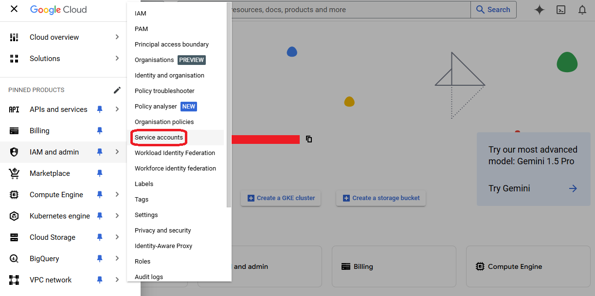
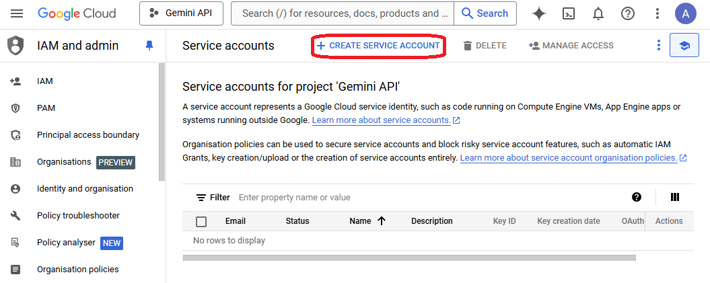
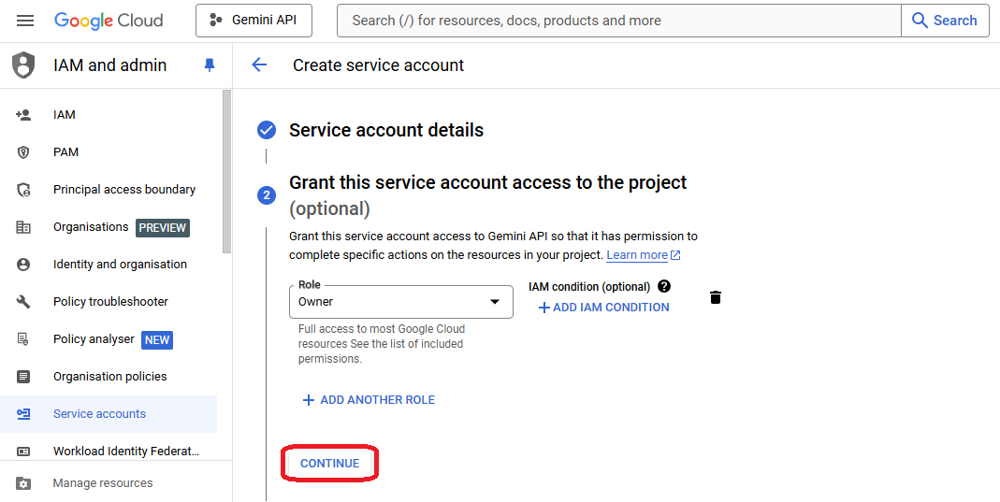
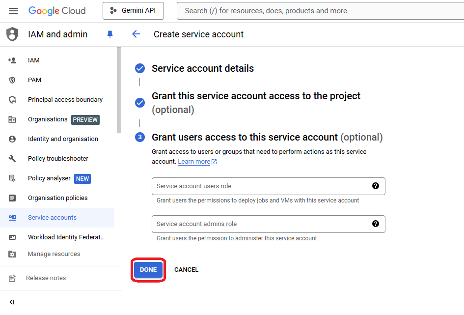
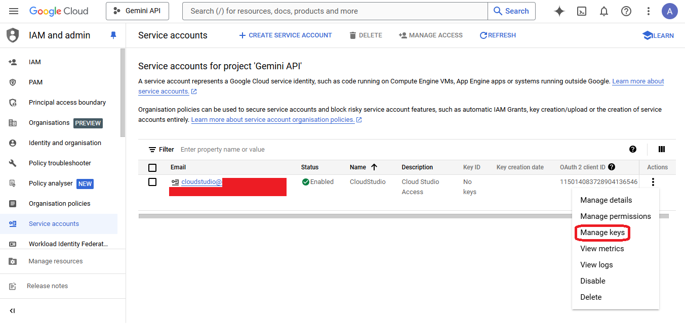
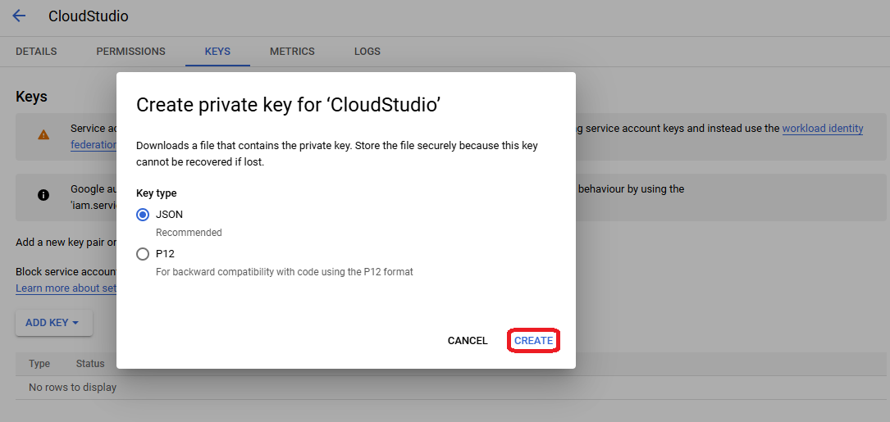
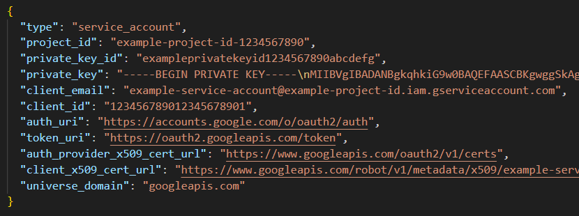

# How to generate credentials in GCP?

To access GCP, you generate credentials using **Service accounts on IAM console**.

The credentials in GCP include ONE single file in JSON format that contains all the neccessary information for authentication.

## Service account keys

The service accounts are used for external applications (like CloudStudio) to access resources on a GCP account, controling its access through roles and permissions.

::: info
Every service account belongs to an specific project within GCP, so every resource created though a service account will live on that specfic project. To use a service account, the external app will connect to it by a JSON file created in the IAM console and downloaded on local machine.
:::

1. First go to the "Security accounts" console after logging in

2. In the new opened console click "Create Service Account" 

3. Give it a name and appropriate description

4. Grant "Owner" role to access most GCP resources within that project

5. Skip the "Grant users access" step and confirm operation

6. Back to the Service accounts list, select the recently created and click "Manage Keys"

7. Click on the selector "Add Key" and then on the "Create New Key" option

8. Choose JSON format and click on "Create" to download the credentials file

## Add secrets to CloudStudio

:::info
After downloading the credentials JSON file, its content should look like this
:::

1. Go to the Google provider on the CloudStudio dashboard and click "add secret"

2. Copy the root to the JSON file, paste it on the app_credentials value and apply changes

3. Finally set created secret to the current app environment

