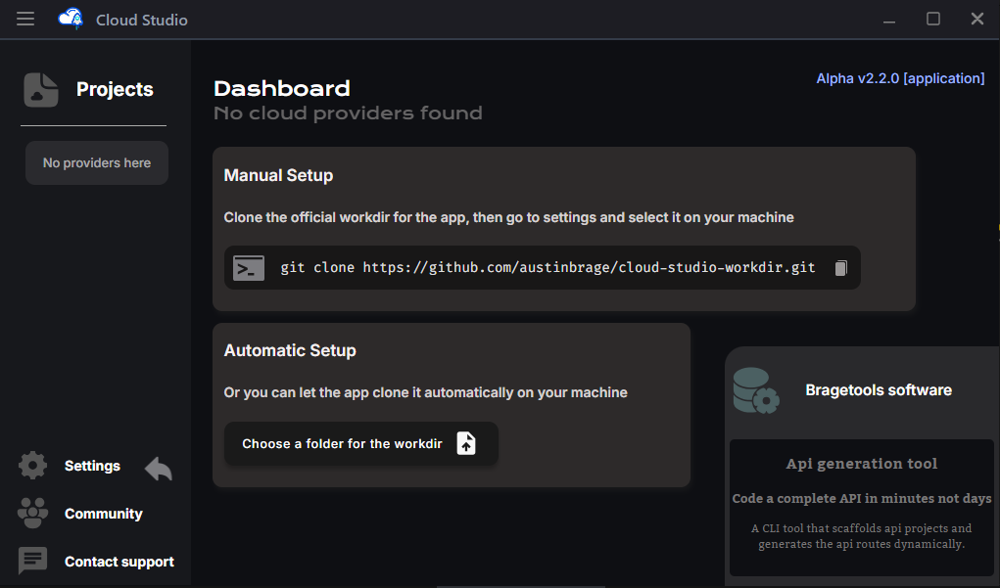
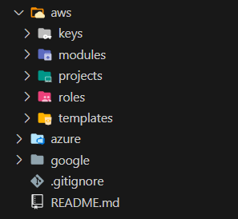
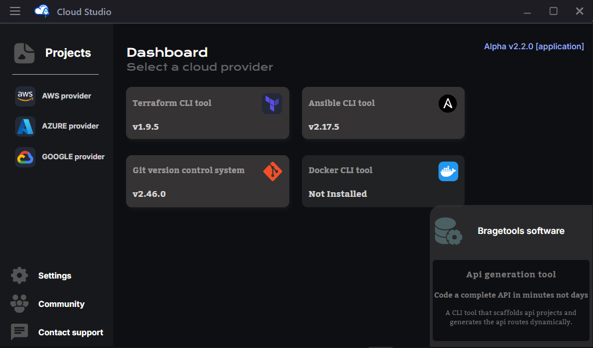

# Getting Started

## App Installer

[Place installer files]

## Empty Dashboard

When you open the dashboard for the first time you won't have a **working-directory** set.

:::info What is the workdir?
The working directory or "workdir" is just a folder on your local mochine where all of your work made on the app will be stored and executed on the cloud.

- *The app is intended to work with an **official workdir** stored on a public github repo, so it must be cloned on the machine and set it on the app in order to work*.
:::

:::tip Choosing a working-directory
On the panel you will have 2 options to set the workdir: 

1. You can do it manually, copying the git clone command, executing it on your computer and selecting it on the app clicking on **settings** on the leftside menu and following the arrows.

2. Or you can it automatically, clicking on the indicated button and choosing any folder on your computer where you want to store your workdir, and then the app is gonna do the rest. 
:::

## Prepared Dashboard

Once you cloned and selected the official workdir on your machine, it will look like this.

- *Three folders for the three main cloud providers out there (aws, azure and gcp)*. 
- *And inside each one of these, a folder for keys (ssh), templates, projects, etc*.

The application read the folders on the root of the workdir and list them on the leftmenu.

- *CloudStudio is prepered for the main 3 cloud providers, so its corresponding logos*. 
- *By clicking in any of them, it will take the dashboard to list there template, projects, etc*. 

